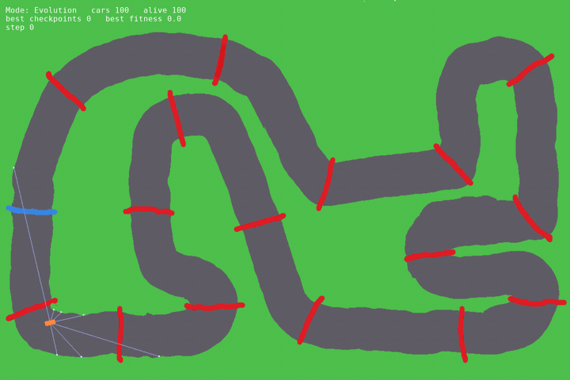
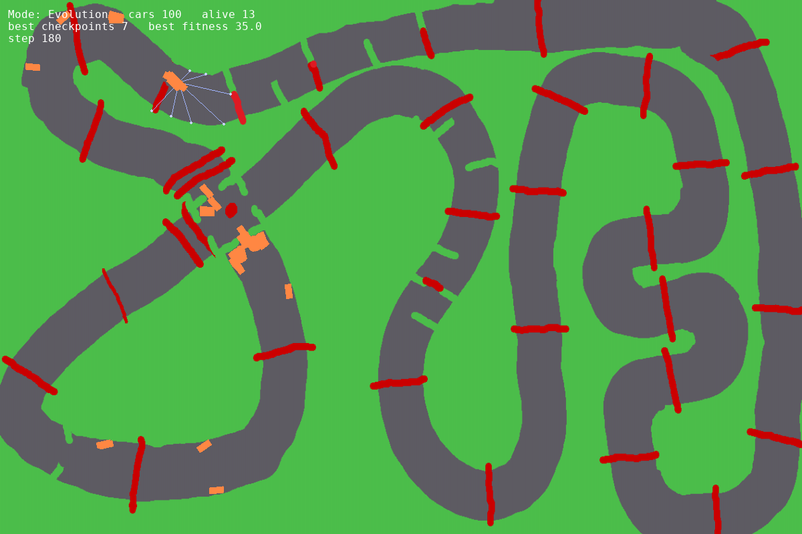

I made this project to learn more about nueral networks and how they learn/evolve. I only wanted to focus of the training and brain part so the simulation was designed by claude code at first so I could focus on creating and tranning the brain

# NeuroRacer

Cars that teach themselves to drive around a track I drew in an image editor. Each car has seven distance sensors, a tiny neural network for a brain, and a choice of three moves. Two different ways of learning are built in — a Deep Q-Network and a genetic algorithm — and a single flag in `config.py` switches between them.



*One generation of 100 cars. Car 0 carries the saved `simpleJoe02` brain; the other 99 are mutated copies of it. The blue lines are the leading car's sensors.*

## What this is

I wanted to understand reinforcement learning by building something I could actually watch. So instead of a Gym environment I built the whole thing from scratch in `pygame`:

- the **track** is a PNG — grey road on green grass, red lines for checkpoints, a blue line for the start/finish;
- the **car** is a rectangle with sensors that ray-cast until they hit the edge of the road;
- the **brain** is a 9 → 16 → 16 → 3 network in PyTorch;
- and the **learning** is either a DQN (one shared brain, trained from replay memory) or evolution (one brain per car, breed the best three every generation).

I started with the DQN and moved on to evolution mostly out of curiosity about how a much simpler method would compare. Both still work and you can flip between them.

## How it works

### The simulation

`main.py` loads a track image and classifies every pixel as road or not by colour (`build_drivable_array` — grey asphalt, tan dirt, and the red/blue marker lines all count as road). That becomes a `pygame.mask`, trimmed to the connected blob of road that contains the start position, so a stray grey patch elsewhere in the picture can't be driven on. The inverse mask is what the car collides with.

The car (`car.py`) is a simple arcade model: throttle adds speed, friction removes it, steering turns the heading only while moving. Movement is **sub-stepped** one pixel at a time and collision-checked at each step, so a fast car cannot tunnel through a thin bit of grass. Seven sensors at −90°, −60°, −30°, 0°, 30°, 60°, 90° from the heading walk outward pixel by pixel until they leave the road (max 400 px).

### The brain

`Brain.py` — a three-layer MLP:

| | |
|---|---|
| **Input (9)** | 7 sensor distances (normalised 0–1), speed (normalised), crashed flag |
| **Hidden** | 16 → 16, ReLU |
| **Output (3)** | 0 = straight, 1 = steer left, 2 = steer right — throttle is always on |

The same class is used for both training modes; in DQN mode the outputs are Q-values, in evolution mode they're just "whichever is biggest wins".

### Checkpoints are drawn on the picture

There is no list of checkpoint coordinates anywhere. `checkpoints.py` scans the track image for red pixels, groups them into connected blobs, and reduces each blob to a straight segment along its principal axis (an SVD of the pixel coordinates). Brush thickness doesn't matter — only where the line is and which way it points. Blue does the same thing for the lap line.

Scoring is a segment-intersection test between the car's movement this frame and each gate, so it can't skip a gate by going fast. Two rules stop the reward from being farmed:

- a checkpoint goes on **cooldown** until at least one *other* checkpoint has been crossed, so shuttling back and forth over one line earns nothing;
- the lap line can be gated on `LAP_REQUIRES_CHECKPOINTS` so parking on the finish line doesn't pay out every frame.

Rewards (all in `config.py`): +5 per checkpoint, +10 per lap, −2 for crashing.

### Two ways to learn

| | DQN (`parent_evolution = False`) | Evolution (`parent_evolution = True`) |
|---|---|---|
| Brains | one shared `CarBrain` + a target network | one `CarBrain` per car (100 of them) |
| Experience | replay memory of 10,000 transitions, batch 64, γ = 0.99 | none — each car's total reward for the generation is its fitness |
| Exploration | ε-greedy, 1.0 → 0.05, ×0.995 per episode | mutation only |
| Update | MSE on Bellman targets after every frame; target net synced every 500 steps | top 3 cars survive unchanged; the rest are children of those three |
| Breeding | — | per-weight uniform crossover from 3 parents, then 5% of weights get Gaussian noise (σ = 0.05) |
| What gets saved | model + optimizer + ε | the fittest brain only |
| On reload | resume training | saved brain becomes one seed; the other 99 start random to keep diversity |

Both modes run all 100 cars on screen at once. A generation (or DQN episode) ends when every car has crashed, when a car hits `MAX_EPISODE_STEPS`, or when only `SURVIVOR_LIMIT` cars are left for `SURVIVOR_EXTRA_STEPS` frames — that last rule keeps training moving when one lucky car would otherwise drive alone for minutes.

## Running it

Needs Python 3.12. A GPU is not required.

```bash
python3 -m venv .env
source .env/bin/activate
pip install -r requirements.txt
python main.py
```

| Key | |
|---|---|
| `S` | save the current best brain (evolution) or the shared model (DQN) to `models/<MODEL_NAME>` |
| `Esc` / close window | save and quit |

The model also autosaves every 25 episodes. Everything worth changing is in `config.py`:

- `parent_evolution` — pick the training mode
- `MODEL_NAME`, `TRACK_NAME` — which brain to load/save and which image in `tracks/` to drive on
- `START_X`, `START_Y`, `START_ANGLE` — must be on the road for that track
- `NUM_CARS`, `MAX_EPISODE_STEPS`, `SURVIVOR_LIMIT`, `SURVIVOR_EXTRA_STEPS` — generation size and when to cut it short
- `MUTATION_RATE`, `MUTATION_STRENGTH` — how much children differ from parents
- `show_sens` — draw every car's sensors (slow with 100 cars, great for debugging)

### Drawing your own track

Any image will do — it's scaled to 1200 × 800 on load. Paint the road in a flat grey (or tan), the background in something clearly not road, then:

- draw each **checkpoint as its own red line** spanning the full width of the road, otherwise cars just drive around the end of it;
- draw the **start/finish as a blue line** the same way;
- a bit of overspill onto the grass is fine and expected — lines that touch each other are read as one gate;
- set `START_X/Y/ANGLE` in `config.py` and check the console says `Found N checkpoint(s)` when you run it.

The tracks in `tracks/` are all MS-Paint-grade scribbles and work fine.



### Regenerating the GIF

`tools/render_demo.py` runs one generation headless (car 0 = the saved model, the rest mutated copies), writes `docs/demo.gif` and `docs/screenshot.png`, and needs `ffmpeg` on your PATH. With no arguments it uses the track and model from `config.py`:

```bash
python tools/render_demo.py
python tools/render_demo.py --track speedway.png --model simpleJoe.pth --seconds 15 --fps 25
python tools/render_demo.py --help
```

## Project layout

| File | |
|---|---|
| `main.py` | loads the track, builds the road mask, runs the game loop, and drives whichever training mode is selected |
| `car.py` | car physics, collision, sensors, and the state vector the brain sees |
| `Brain.py` | the `CarBrain` network |
| `trainer.py` | action selection, replay memory, and the DQN update step |
| `evolutionHandle.py` | crossover + mutation for the genetic algorithm |
| `checkpoints.py` | red/blue line detection and the checkpoint / lap scoring |
| `config.py` | every knob |
| `tracks/` | track images |
| `models/` | saved brains (see below) |
| `docs/` | the GIF and screenshot above |
| `tools/render_demo.py` | regenerates them |

## Saved models

The network changed shape as the project went on, so not every checkpoint in `models/` loads with the current 3-output brain. I've kept the old ones as a record of where it's been.

| Model | Mode | Actions | Episodes |
|---|---|---|---|
| `Gilbert.pth`, `car_model01.pth` | DQN | 5 | 7,444 / 8,585 |
| `F1car.pth`, `F1carCOPY.pth`, `carBrain03.pth`, `nascar.pth` | DQN | 6 | 6,000 – 11,000 |
| `MutantHIGH.pth`, `MutantLOW.pth` | mutation experiments <!-- saved with optimizer state, so from the DQN-era code — correct me --> | 6 | 80 / 274 |
| `simpleJoe.pth`, `simpleJoe02.pth` | evolution | 3 | 1,362 / 4,059 |

`simpleJoe02` is the one in the GIF — on `track.png` it completes a lap and keeps going (21 gate crossings, 16 gates), and on the harder `crossRoad.png` it clears 19 of 36 checkpoints before crashing.

## What I learned

- **Reward design is most of the work.** Every shortcut the cars found was a hole in the reward, not a bug in the car. Shuttling back and forth over one checkpoint led to the cooldown rule; the idea of a car parking on the finish line led to gating laps behind checkpoints. Ideally I'd have checked the reward for exploits before training, rather than after.
- **Fitness has to be per car.** An earlier version didn't keep a separate score for each car, which made "pick the best three" meaningless — the fix is the one still marked `CRITICAL FIX` in `main.py`. Selection is only as good as the bookkeeping behind it.
- **Sign errors in rewards are silent.** Until the last round of fixes, crashing was worth *+2* (a negative penalty, subtracted). The cars still learned, because +5 per checkpoint dominated, so nothing obviously broke. Reward code deserves a tiny test.
- **DQN has more knobs than I expected.** Replay memory size, batch size, γ, target-network sync rate, ε schedule, learning rate — and it needed thousands of episodes to get anywhere. Evolution with 100 cars running in parallel was far easier to reason about: I could literally watch selection happen.
- **Evolution needs diversity.** Reloading the saved brain into all 100 cars just gives 100 copies of the same driver. Seeding one car and leaving the rest random was the difference between a population that improves and one that stalls.
- **A smaller action space learned faster.** Going from 6 actions (with braking/reversing) to 3 (always accelerate, choose a direction) gave the cars less to get wrong — but changing the network shape orphaned every previously saved model.
- **Training throughput matters more than I thought.** Cutting a generation short once only a few survivors are left, and capping steps per episode, made a real difference to how many generations I could run in a sitting.


